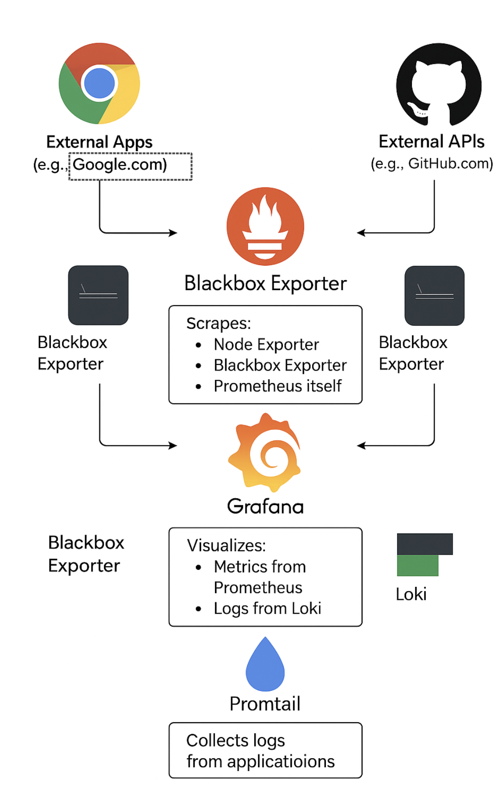

# **Technical User Design Document: Kubernetes Observability Stack**

## **Overview**
This document provides a step-by-step guide to set up an observability stack using Kubernetes and Helm. It includes all the prerequisites, file descriptions, commands, and configurations required to deploy and manage the solution. The observability stack consists of Prometheus, Grafana, Loki, Promtail, Node Exporter and Blackbox exporter.

---

## **Prerequisites**
Before starting, ensure the following tools are installed and configured:
1. **kubectl**: Kubernetes command-line tool.
   - Install: [kubectl installation guide](https://kubernetes.io/docs/tasks/tools/install-kubectl/)
2. **Helm**: Kubernetes package manager.
   - Install: [Helm installation guide](https://helm.sh/docs/intro/install/)
3. **Minikube** (optional): Local Kubernetes cluster for testing.
   - Install: [Minikube installation guide](https://minikube.sigs.k8s.io/docs/start/)

---

## **Directory Structure**
Here is the directory structure of the Helm chart used for the observability stack:

```
helm-kube-observability-stack/
├── charts/
├── templates/
│   ├── grafana-deployment.yaml
│   ├── grafana-service.yaml
│   ├── loki-deployment.yaml
│   ├── loki-service.yaml
│   ├── node-exporter-daemonset.yaml
│   ├── node-exporter-service.yaml
│   ├── prometheus-deployment.yaml
│   ├── prometheus-service.yaml
│   ├── prometheus-config.yaml
│   ├── promtail-deployment.yaml
│   ├── promtail-service.yaml
│   ├── promtail-config.yaml
│   ├── blackbox-exporter-deployment.yaml
│   ├── blackbox-exporter-service.yaml
│   ├── blackbox-exporter-config.yaml
│   ├── prometheus-config.yaml
│   ├── namespace.yaml
│   ├── ingress.yaml
│   ├── NOTES.txt
├── values.yaml
├── Chart.yaml
```

---
## **Architecture**




## **Purpose of Each File**

### **Deployment Files**
#### 1. **grafana-deployment.yaml**
- Deploys Grafana pods.
- Configures Grafana container image, resource limits, and environment variables.
- Exposes Grafana on port `3000`.

```yaml
apiVersion: apps/v1
kind: Deployment
metadata:
  name: grafana
  namespace: {{ .Values.namespace }}
spec:
  replicas: 1
  selector:
    matchLabels:
      app: grafana
  template:
    metadata:
      labels:
        app: grafana
    spec:
      containers:
      - name: grafana
        image: {{ .Values.grafana.image }}
        ports:
        - containerPort: 3000
          name: http
        env:
        - name: GF_SECURITY_ADMIN_PASSWORD
          value: {{ .Values.grafana.adminPassword }}
        resources:
          limits:
            cpu: {{ .Values.grafana.resources.limits.cpu }}
            memory: {{ .Values.grafana.resources.limits.memory }}
          requests:
            cpu: {{ .Values.grafana.resources.requests.cpu }}
            memory: {{ .Values.grafana.resources.requests.memory }}
```

#### 2. **loki-deployment.yaml**:
   - Deploys Loki pods.
   - Configures Loki container image and resource limits.
   - Exposes Loki on port `3100`.
```yaml
apiVersion: apps/v1
kind: Deployment
metadata:
  name: loki
  namespace: {{ .Values.namespace }}
spec:
  replicas: {{ .Values.loki.replicas }}
  selector:
    matchLabels:
      app: loki
  template:
    metadata:
      labels:
        app: loki
    spec:
      containers:
      - name: loki
        image: {{ .Values.loki.image }}
        ports:
        - containerPort: 3100
          name: http
        resources:
          limits:
            cpu: {{ .Values.loki.resources.limits.cpu }}
            memory: {{ .Values.loki.resources.limits.memory }}
          requests:
            cpu: {{ .Values.loki.resources.requests.cpu }}
            memory: {{ .Values.loki.resources.requests.memory }}
```
#### 3. **prometheus-deployment.yaml**:
   - Deploys Prometheus pods.
   - Configures Prometheus container image and resource limits.
   - Exposes Prometheus on port `9090`.
```yaml
apiVersion: apps/v1
kind: Deployment
metadata:
  name: prometheus
  namespace: {{ .Values.namespace }}
spec:
  replicas: {{ .Values.prometheus.replicas }}
  selector:
    matchLabels:
      app: prometheus
  template:
    metadata:
      labels:
        app: prometheus
    spec:
      containers:
      - name: prometheus
        image: {{ .Values.prometheus.image }}
        resources:
          limits:
            cpu: {{ .Values.prometheus.resources.limits.cpu }}
            memory: {{ .Values.prometheus.resources.limits.memory }}
          requests:
            cpu: {{ .Values.prometheus.resources.requests.cpu }}
            memory: {{ .Values.prometheus.resources.requests.memory }}
        volumeMounts:
        - name: prometheus-config
          mountPath: /etc/prometheus
      volumes:
      - name: prometheus-config
        configMap:
          name: prometheus-config
```
#### 4. **promtail-deployment.yaml**:
   - Deploys Promtail pods.
   - Configures Promtail container image and resource limits.
   - Mounts the Promtail configuration file.
```yaml
// filepath: /Users/skumark5/Documents/opensource-observability-package/Kubernetes Approach/helm-kube-observability-stack/templates/promtail-deployment.yaml
apiVersion: apps/v1
kind: Deployment
metadata:
  name: promtail
  namespace: {{ .Values.namespace }}
spec:
  replicas: 1
  selector:
    matchLabels:
      app: promtail
  template:
    metadata:
      labels:
        app: promtail
    spec:
      containers:
      - name: promtail
        image: {{ .Values.promtail.image }}
        ports:
        - containerPort: 9080
          name: http
        resources:
          limits:
            cpu: {{ .Values.promtail.resources.limits.cpu }}
            memory: {{ .Values.promtail.resources.limits.memory }}
          requests:
            cpu: {{ .Values.promtail.resources.requests.cpu }}
            memory: {{ .Values.promtail.resources.requests.memory }}
        args:
        - -config.file=/etc/promtail/promtail-config.yaml
        volumeMounts:
        - name: promtail-config
          mountPath: /etc/promtail
      volumes:
      - name: promtail-config
        configMap:
          name: promtail-config
```
#### 5. **node-exporter-daemonset.yaml**:
   - Deploys Node Exporter as a DaemonSet to collect node-level metrics.
   - Exposes Node Exporter on port `9100`.
```yaml
apiVersion: apps/v1
kind: DaemonSet
metadata:
  name: node-exporter
  namespace: {{ .Values.namespace }}
spec:
  selector:
    matchLabels:
      app: node-exporter
  template:
    metadata:
      labels:
        app: node-exporter
    spec:
      containers:
      - name: node-exporter
        image: {{ .Values.nodeExporter.image }}
        ports:
        - containerPort: 9100
          name: http
        resources:
          limits:
            cpu: {{ .Values.nodeExporter.resources.limits.cpu }}
            memory: {{ .Values.nodeExporter.resources.limits.memory }}
          requests:
            cpu: {{ .Values.nodeExporter.resources.requests.cpu }}
            memory: {{ .Values.nodeExporter.resources.requests.memory }}
```

#### 6. **blackbox-exporter-deployment.yaml**:
   - Deploys Blackbox Exporter pods.
   - Configures Blackbox Exporter container image and resource limits.
   - Mounts the Blackbox Exporter configuration file.
   - Exposes Blackbox Exporter on port `9115`
```yaml
apiVersion: apps/v1
kind: Deployment
metadata:
  name: blackbox-exporter
  namespace: {{ .Values.namespace }}
spec:
  replicas: 1
  selector:
    matchLabels:
      app: blackbox-exporter
  template:
    metadata:
      labels:
        app: blackbox-exporter
    spec:
      containers:
      - name: blackbox-exporter
        image: prom/blackbox-exporter:latest
        ports:
        - containerPort: 9115
          name: http
        resources:
          limits:
            cpu: {{ .Values.blackboxExporter.resources.limits.cpu }}
            memory: {{ .Values.blackboxExporter.resources.limits.memory }}
          requests:
            cpu: {{ .Values.blackboxExporter.resources.requests.cpu }}
            memory: {{ .Values.blackboxExporter.resources.requests.memory }}
        volumeMounts:
        - name: blackbox-config
          mountPath: /etc/blackbox
      volumes:
      - name: blackbox-config
        configMap:
          name: blackbox-exporter-config
```
---

### **Service Files**
#### 1. **grafana-service.yaml**:
   - Exposes Grafana internally via `ClusterIP` or externally via `NodePort`.
   - Port: `3000`.
```yaml
apiVersion: v1
kind: Service
metadata:
  name: grafana
  namespace: {{ .Values.namespace }}
spec:
  selector:
    app: grafana
  ports:
    - name: http
      port: 3000
      targetPort: 3000
  type: ClusterIP
```
#### 2. **loki-service.yaml**:
   - Exposes Loki internally via `ClusterIP`.
   - Port: `3100`.
```yaml
apiVersion: v1
kind: Service
metadata:
  name: loki
  namespace: {{ .Values.namespace }}
spec:
  selector:
    app: loki
  ports:
    - name: http
      port: 3100
      targetPort: 3100
  type: ClusterIP
```
#### 3. **prometheus-service.yaml**:
   - Exposes Prometheus internally via `ClusterIP`.
   - Port: `9090`.
```yaml
apiVersion: v1
kind: Service
metadata:
  name: prometheus
  namespace: {{ .Values.namespace }}
spec:
  selector:
    app: prometheus
  ports:
    - name: http
      port: 9090
      targetPort: 9090
  type: ClusterIP
```
#### 4. **promtail-service.yaml**:
   - Exposes Promtail internally via `ClusterIP`.
   - Port: `9080`.
```yaml
apiVersion: v1
kind: Service
metadata:
  name: promtail
  namespace: {{ .Values.namespace }}
spec:
  selector:
    app: promtail
  ports:
    - name: http
      port: 9080
      targetPort: 9080
  type: ClusterIP
```
#### 5. **node-exporter-service.yaml**:
   - Exposes Node Exporter internally via `ClusterIP`.
   - Port: `9100`.
```yaml
apiVersion: v1
kind: Service
metadata:
  name: node-exporter
  namespace: {{ .Values.namespace }}
spec:
  selector:
    app: node-exporter
  ports:
    - name: http
      port: 9100
      targetPort: 9100
  type: ClusterIP
```
#### 6. **blackbox-exporter-service.yaml**:
   - Exposes Blackbox Exporter internally via `ClusterIP`.
   - Port: `9115`.
```yaml
apiVersion: v1
kind: Service
metadata:
  name: blackbox-exporter
  namespace: {{ .Values.namespace }}
spec:
  selector:
    app: blackbox-exporter
  ports:
    - name: http
      port: 9115
      targetPort: 9115
  type: ClusterIP
```
---

### **Configuration Files**
#### 1. **promtail-config.yaml**:
   - Defines Promtail scrape targets and labels.
   - Configures Promtail to send logs to Loki.
```yaml
apiVersion: v1
kind: ConfigMap
metadata:
  name: promtail-config
  namespace: {{ .Values.namespace }}
data:
  promtail-config.yaml: |
    server:
      http_listen_port: 9080
    clients:
      - url: http://loki:3100/loki/api/v1/push
    scrape_configs:
      - job_name: "varlogs"
        static_configs:
          - targets:
              - localhost
            labels:
              job: "varlogs"
              __path__: /var/log/*log
```
#### 2. **blackbox-exporter-config.yaml**:
   - Defines Blackbox Exporter modules for probing endpoints.
   - Configures HTTP probing with the http_2xx module.
```yaml
apiVersion: v1
kind: ConfigMap
metadata:
  name: blackbox-exporter-config
  namespace: {{ .Values.namespace }}
data:
  blackbox.yml: |
    modules:
      http_2xx:
        prober: http
        timeout: 5s
        http:
          method: GET
          valid_http_versions: ["HTTP/1.1", "HTTP/2"]
          fail_if_ssl: false
          fail_if_not_ssl: false
          valid_status_codes: []
```
#### 2. **prometheus-config.yaml**:
   - Configures Prometheus to scrape metrics from Blackbox Exporter.
   - Defines scrape jobs for external endpoints.
```yaml
apiVersion: v1
kind: ConfigMap
metadata:
  name: prometheus-config
  namespace: {{ .Values.namespace }}
data:
  prometheus.yml: |
    global:
      scrape_interval: 15s
      evaluation_interval: 15s

    scrape_configs:
      # Default Prometheus scrape job
      - job_name: 'prometheus'
        static_configs:
          - targets: ['localhost:9090']

      # Blackbox Exporter scrape job
      - job_name: 'blackbox'
        metrics_path: /probe
        params:
          module: [http_2xx]
        static_configs:
          - targets:
              - https://www.google.com
              - https://www.github.com
              - https://www.example.com
        relabel_configs:
          - source_labels: [__address__]
            target_label: __param_target
          - source_labels: [__param_target]
            target_label: instance
          - target_label: __address__
            replacement:
```
####  2. **values.yaml**:
   - Centralized configuration for the Helm chart.
   - Defines replicas, resource limits, container images, and other parameters.

```yaml
## Existring code ...

#*************************************************************
# Observability stack-specific configurations
#*************************************************************

namespace: kube-observability-stack

prometheus:
  image: prom/prometheus:v2.45.0
  replicas: 1
  resources:
    limits:
      cpu: 500m
      memory: 512Mi
    requests:
      cpu: 250m
      memory: 256Mi

nodeExporter:
  image: prom/node-exporter:v1.6.1
  resources:
    limits:
      cpu: 200m
      memory: 128Mi
    requests:
      cpu: 100m
      memory: 64Mi

loki:
  image: grafana/loki:2.9.7
  replicas: 1
  resources:
    limits:
      cpu: 500m
      memory: 512Mi
    requests:
      cpu: 250m
      memory: 256Mi

promtail:
  image: grafana/promtail:2.9.7
  resources:
    limits:
      cpu: 200m
      memory: 128Mi
    requests:
      cpu: 100m
      memory: 64Mi

grafana:
  image: grafana/grafana:10.0.3
  adminPassword: admin
  resources:
    limits:
      cpu: 500m
      memory: 512Mi
    requests:
      cpu: 250m
      memory: 256Mi
blackboxExporter:
  resources:
    limits:
      cpu: "500m"
      memory: "128Mi"
    requests:
      cpu: "250m"
      memory: "64Mi"
```
---

### **Other Files**
#### 1. **namespace.yaml**:
   - Creates a dedicated namespace for the observability stack.
```yaml
# filepath: namespace.yaml
apiVersion: v1
kind: Namespace
metadata:
  name: kube-observability-stack
```
#### 2. **ingress.yaml**:
   - Configures ingress rules for external access (optional).
```yaml
Keep it as it is
```
#### 3. **Chart.yaml**:
   - Metadata for the Helm chart (name, version, description).
```yaml
Keep it as it is
```
####  4. **NOTES.txt**:
   - Provides post-installation instructions.
```yaml
Keep it as it is
```
---

## **Steps to Build the Solution**

### **Step 1: Create Namespace**
Apply the namespace file:
```bash
kubectl apply -f templates/namespace.yaml
```

---

### **Step 2: Deploy the Helm Chart**
Install the Helm chart:
```bash
cd --> same directory as helm
helm install observability-stack helm-kube-observability-stack --namespace kube-observability-stack

# Once you modify anything then 
helm upgrade observability-stack helm-kube-observability-stack --namespace kube-observability-stack

```


---

### **Step 3: Verify Deployments and Services**
Check the status of deployments:
```bash
kubectl get deployments -n kube-observability-stack
```

Check the status of services:
```bash
kubectl get services -n kube-observability-stack
```

---

### **Step 4: Port forwarding & Access Applications**
Port forwarding is used to temporarily expose a Kubernetes service running inside the cluster to your local machine. This allows you to access applications like Grafana, Prometheus, and Loki through your web browser or other tools without needing external access or ingress configurations.

Kubernetes services (like Grafana, Prometheus, Loki) are typically accessible only within the cluster.
Port forwarding creates a tunnel between your local machine and the Kubernetes service, mapping the service's port to your local machine's port.
This lets you access the service using ttp://localhost:<local-port>.

#### **Grafana**
1. Port-forward Grafana:
   ```bash
   kubectl port-forward svc/grafana 3000:3000 -n kube-observability-stack
   ```
2. Access Grafana at `http://localhost:3000`.

#### **Prometheus**
1. Port-forward Prometheus:
   ```bash
   kubectl port-forward svc/prometheus 9090:9090 -n kube-observability-stack
   ```
2. Access Prometheus at `http://localhost:9090`.

#### **Loki**
1. Port-forward Loki:
   ```bash
   kubectl port-forward svc/loki 3100:3100 -n kube-observability-stack
   ```
2. Access Loki at `http://localhost:3100`.

#### **Blackbox**
1. Port-forward Loki:
   ```bash
   kubectl port-forward svc/blackbox-exporter 9115:9115 -n kube-observability-stack
   ```
2. Access Loki at `http://localhost:9115`.
---

### **Step 4: Port forwarding replacement | Permanent solution **
If port forwarding is temporary, the permanent solution for exposing Kubernetes services to external users is to use Ingress or LoadBalancer service types. These methods provide stable and permanent access to services running inside the cluster.

## Permanent Solutions
#### Ingress
What It Does:
Ingress is a Kubernetes resource that manages external access to services in a cluster.
It provides HTTP and HTTPS routing based on hostnames and paths.
How It Works:
You define rules in an Ingress resource to route traffic to specific services.
Requires an Ingress Controller (e.g., NGINX, Traefik) to handle the routing.
Example:

```yaml
apiVersion: networking.k8s.io/v1
kind: Ingress
metadata:
  name: grafana-ingress
  namespace: kube-observability-stack
spec:
  rules:
  - host: grafana.example.com
    http:
      paths:
      - path: /
        pathType: Prefix
        backend:
          service:
            name: grafana
            port:
              number: 3000
```
```bash
Access Grafana at http://grafana.example.com.
```

#### LoadBalancer Service
What It Does:
A LoadBalancer service exposes the application to the internet by provisioning a cloud provider's load balancer.
Commonly used in cloud environments (e.g., AWS, Azure, GCP).
How It Works:
Kubernetes automatically provisions a load balancer and assigns an external IP to the service.
Example:

```yaml
apiVersion: v1
kind: Service
metadata:
  name: grafana
  namespace: kube-observability-stack
spec:
  selector:
    app: grafana
  ports:
  - name: http
    port: 3000
    targetPort: 3000
  type: LoadBalancer
```

#### NodePort Service
What It Does:
Exposes the service on a specific port of each node in the cluster.
Accessible via <node-ip>:<node-port>.
How It Works:
The service is mapped to a port on the node, and traffic is routed to the pods.
Example:

```yaml
apiVersion: v1
kind: Service
metadata:
  name: grafana
  namespace: kube-observability-stack
spec:
  selector:
    app: grafana
  ports:
  - name: http
    port: 3000
    targetPort: 3000
    nodePort: 32000
  type: NodePort
```

```bash
Access Grafana at http://<node-ip>:32000.
```

## Comparison of Methods
### **Comparison of Methods**

| **Method**      | **Use Case**                    | **Pros**                                 | **Cons**                              |
|-----------------|----------------------------------|-------------------------------------------|----------------------------------------|
| Ingress         | HTTP/HTTPS routing              | Flexible routing, hostname-based          | Requires Ingress Controller            |
| LoadBalancer    | Cloud environments              | External IP, easy setup                   | Cloud provider dependency              |
| NodePort        | Local testing or small clusters | Simple setup                              | Limited scalability, manual IP use     |

### Recommendation
- Use Ingress for production environments where you need hostname-based routing and HTTPS support.
- Use LoadBalancer in cloud environments for direct external access.
- Use NodePort for testing or small-scale setups.


### **Step 5: Query Logs in Grafana**
1. Add Loki as a data source in Grafana.
2. Use queries like:
   - `{job="varlogs"}`
   - `{job="varlogs"} |= "error"`
3. Add Prometheus as a data source in Grafana.
   1. Use queries like:
   2. - `{probe_success{job="blackbox"}`
   3. - This query shows whether the probes to the endpoints were successful (1 for success, 0 for failure).

---

## **Why Helm Chart Over Bash Scripts?**
1. **Modularity**:
   - Helm charts allow modular configuration and deployment.
   - Easy to update individual components.

2. **Reusability**:
   - Helm charts can be reused across environments (e.g., dev, prod).

3. **Scalability**:
   - Helm simplifies scaling and upgrading applications.

4. **Declarative Approach**:
   - Helm uses YAML files for declarative configuration, making it easier to manage.

---

## **Ports and Access**
| Application   | Port  | Access Method           |
|---------------|-------|-------------------------|
| Grafana       | 3000  | Port-forward or NodePort|
| Prometheus    | 9090  | Port-forward            |
| Loki          | 3100  | Port-forward            |
| Node Exporter | 9100  | Internal ClusterIP      |
| Promtail      | 9080  | Internal ClusterIP      |
| Blackbox      | 9115  | Internal ClusterIP      |

---

## **Commands Summary**
### **Install Helm Chart that you have created**
```bash
helm install observability-stack helm-kube-observability-stack --namespace kube-observability-stack
```

### **Upgrade Helm Chart**
```bash
helm upgrade observability-stack helm-kube-observability-stack --namespace kube-observability-stack
```

### **Check Deployments**
```bash
kubectl get deployments -n kube-observability-stack
```

### **Check Services**
```bash
kubectl get services -n kube-observability-stack
```

---